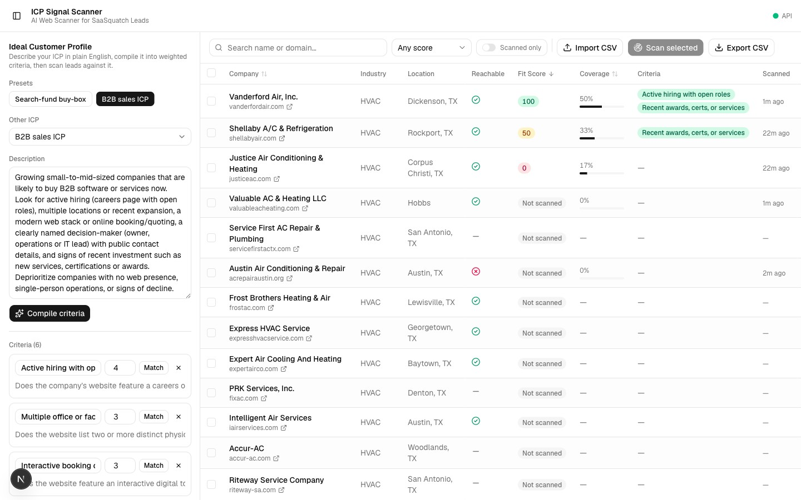
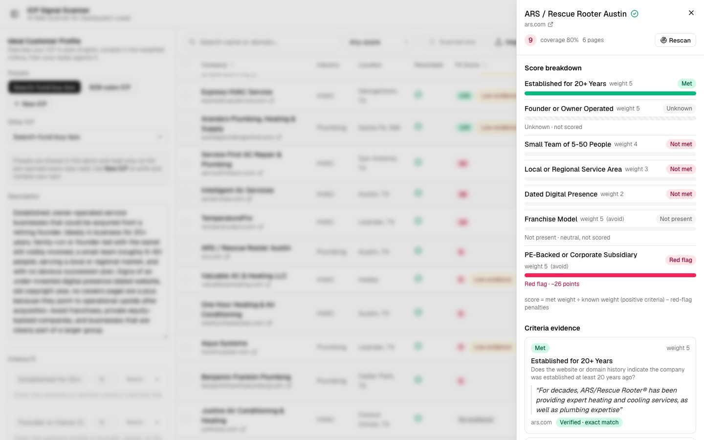
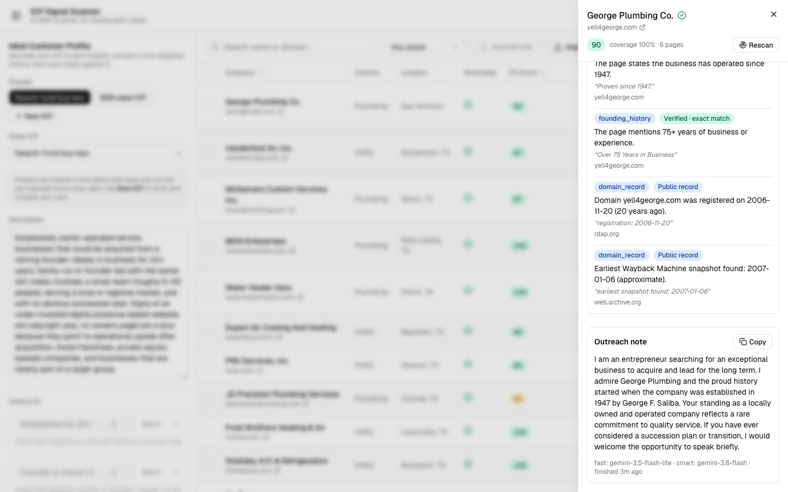
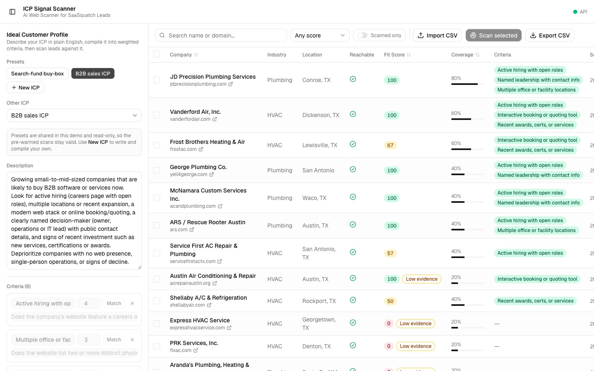
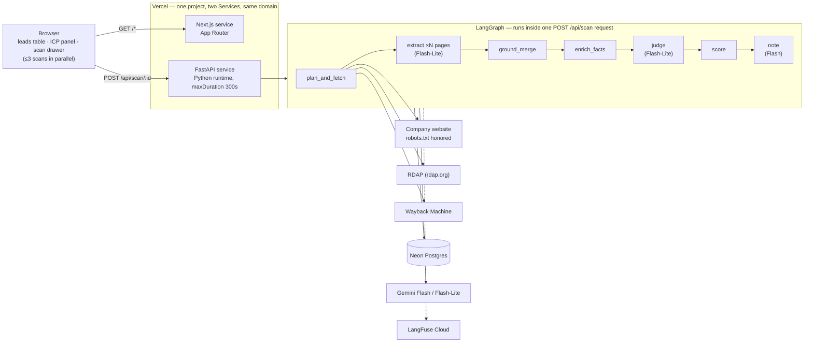

# ICP Signal Scanner

**AI Web Scanner for SaaSquatch Leads** · Caprae Capital Full Stack Developer take-home
Built by Abdul Hai · abdulhai.elegant@gmail.com

ICP Signal Scanner adds the "AI Web Scanner" feature that SaaSquatch Leads (saasquatchleads.com) lists as *Soon*. A user imports leads, describes their ideal customer in plain English, and the app compiles that description into 4–8 weighted, editable criteria. It then reads each company's public website, RDAP registration record, and Wayback Machine history, and judges every criterion with a **verbatim, source-linked quote**. If a fact can't be verified against the actual page text, it stays **"Unverified" and never contributes to the score** — no criterion is ever guessed. Leads are ranked by fit, each with a grounded outreach note and a one-click HubSpot-shaped CSV export.

Two presets cover both of SaaSquatch's audiences: **Search-fund buy-box** (Caprae's core users — acquisition entrepreneurs looking for an owner-operated business to buy) and **B2B sales ICP** (SaaSquatch's sales teams looking for companies ready to buy software). The differentiator versus the public submissions we reviewed (which use fixed scoring formulas): criteria are **user-defined and evidence-grounded** — unknown stays unknown, it is never silently scored as a miss.

## Live demo

- **App:** https://caprae-icp-signal-scanner.vercel.app (Vercel Hobby, non-commercial demo)
- **Video walkthrough:** _link to be added before submission_

### Try it in 60 seconds
1. Open the live app — leads are already imported and ranked (see caching below).
2. Pick a preset in the left panel: **Search-fund buy-box** or **B2B sales ICP**.
3. Select a few rows and click **Scan selected** (or scan one row). A cached result returns instantly; a fresh scan takes **~30–60 s**.
4. Click a row to open the drawer: score breakdown, per-criterion evidence quotes with source links, extracted facts, and the outreach note.
5. Click **Export CSV** for the HubSpot-shaped file.

~40 scans are pre-warmed (20 leads × 2 presets) so the ranked table loads instantly on first visit — you don't have to wait on a cold scan to see the feature work.

## Screenshots

| Leads table | Score breakdown + evidence | Facts + outreach note |
|---|---|---|
|  |  |  |

Live production view after pre-warming (ranked by score, then coverage):



No "before" screenshots of SaaSquatch are included in this repo. For reference, SaaSquatch's existing Companies table shows an opaque AI-generated score with no visible reasoning and an "N/A" revenue column for most rows — described here in text rather than as a placeholder image.

## Architecture



| Layer | Technology |
|---|---|
| Frontend | Next.js 16.3.5 (App Router, TypeScript), Tailwind v4, shadcn/ui (base-nova), TanStack Table 9.2.4, sonner |
| Backend | FastAPI 0.141, Python 3.12, uv |
| Orchestration | LangGraph 1.2, LangChain 1.4, langchain-google-genai 4.4 (Google GenAI SDK) |
| Fetching | httpx 0.28 (`follow_redirects=True`), trafilatura 2.2, protego (robots.txt) |
| Reliability | tenacity 9 (retry/backoff), rapidfuzz 3.14 (fuzzy grounding) |
| Data | SQLAlchemy 2 (async) + asyncpg, Neon Postgres (pooled) |
| Validation | pydantic v2, pydantic-settings 2.15 |
| Observability | LangFuse 4.15 Cloud |
| Optional | MCP 2.x (local stdio server, non-default `uv` dependency group) |

**Request flow:** every scan is **one synchronous `POST /api/scan/{company_id}?icp_id=`** — the whole LangGraph pipeline runs inside that single HTTP request and the response carries the full result (score, criteria, facts, note). The browser's "Scan selected" queue runs at most **3 companies in parallel** (`web/lib/scan-queue.ts`, concurrency 3); inside each scan, LLM calls are gated by a **per-scan `asyncio.Semaphore(2)`** so at most 2 Gemini calls are in flight at once, honoring the free-tier rate limit. The graph itself budgets 240 s (`asyncio.timeout`) to stay safely inside Vercel's 300 s function ceiling.

## Hosting

Everything runs **serverless on one Vercel project (Hobby plan)** using [Vercel Services](https://vercel.com/docs): a `frontend` service (Next.js) and a `backend` service (FastAPI on Vercel's Python runtime), both on the same domain — no CORS needed.

```json
{
  "$schema": "https://openapi.vercel.sh/vercel.json",
  "services": {
    "frontend": { "root": "web" },
    "backend": { "root": "api", "entrypoint": "app.main:app" }
  },
  "rewrites": [
    { "source": "/api/(.*)", "destination": { "service": "backend" } },
    { "source": "/(.*)", "destination": { "service": "frontend" } }
  ]
}
```

**Why not static?** The core feature requires server-side fetching (robots.txt-aware crawling, RDAP, Wayback) and calls to an LLM with secrets that can't live in the browser — none of that can be a static export.

**Why not containers or a queue?** Vercel Hobby has no long-running background workers, and a single company scan comfortably fits inside one request (`~30–60 s` against a 300 s ceiling), so a queue/worker architecture would add operational cost for no benefit at this scale. Because **nothing runs after the response is sent** on Vercel, the LangFuse trace is flushed synchronously before `run_scan()` returns rather than in a background task.

## Data sources & ethics

- **robots.txt** honored via `protego`; if robots.txt itself returns 401/403 (unreadable), the fetcher is conservative and treats the whole site as disallowed.
- **Identifying User-Agent** (`SCANNER_USER_AGENT`, e.g. `ICPSignalScanner/0.1 (+you@example.com)`) sent on every request.
- **1 request/second per host**, enforced with a per-host `asyncio.Lock` + timestamp.
- **≤6 pages per site**: home page + up to 5 more picked from on-page navigation links (about/team/careers/contact/services categories), falling back to a sitemap hint, never a blind path guess.
- **500 KB response cap** and an 8 s timeout per request; extracted text is capped at ~6,000 characters per page.
- **Wayback Machine fallback only** on timeout, 5xx, or empty extracted text (`< 80` chars) — **never** on 403/429 or when robots.txt disallows the page. A 10-minute process-wide circuit breaker trips after archive.org itself returns 429/5xx so a struggling upstream can't stall scans.
- **Deny-list**: LinkedIn, Google/Google Maps, Facebook, Instagram, X/Twitter are never fetched, regardless of robots.txt.
- **RDAP**: only event dates (registration, expiration, last-changed) are stored from `rdap.org`; no registrant/contact data is ever persisted.
- Only **public website text** is ever sent to Gemini — no PII, no third-party data.
- **Seed data**: ~130 Texas HVAC and plumbing businesses with public websites, pulled from OpenStreetMap via one sequential Overpass query per industry (`craft=hvac`, `craft=plumber`), identifying User-Agent, 30 s backoff on 429/406. © OpenStreetMap contributors, [ODbL](https://opendatacommons.org/licenses/odbl/).
- Any field OSM/RDAP/the website doesn't provide (employees, revenue, LinkedIn, city/state for some rows) is left **blank**, never fabricated.

## ICP compilation & scoring

A plain-English description is turned into **4–8 weighted criteria** by the smart Gemini model (`compile_icp`), each shaped as `{key, label, weight (1–5), test, polarity}`. Compilation is cached by `sha256` of the normalized description text, and the compiled list is fully **user-editable** in the ICP panel (weights, wording); editing criteria marks that edit as authoritative so it won't be silently overwritten by a later re-compile of the same description.

**Score formula** (deterministic, no LLM):

```
known_weight = sum(weight of criteria with a met/not_met verdict)
earned_weight = sum(weight of criteria that are "good":
                     positive polarity + met,  or  negative polarity + not_met)
score    = round(100 × earned_weight / known_weight, 1)   — None if known_weight == 0
coverage = round(100 × count(known verdicts) / count(all criteria), 1)
```

A criterion with an **unknown** verdict never counts toward the numerator or the denominator — it's excluded, not scored as a miss. A **negative**-polarity criterion that is *met* (e.g. "is a franchise") is flagged `disqualified` and earns 0.

**Ranking is evidence-aware:** the table and the CSV export order leads by `score × coverage` (score as tiebreak), so a 100 built on 14 % of the criteria ranks below a 100 built on 57 %. Any score whose coverage is under 40 % also carries a **Low evidence** flag next to it.

**Worked example** (illustrative, not a real scan):

| criterion | weight | polarity | verdict | counted? | earned |
|---|---|---|---|---|---|
| founder_operated | 5 | positive | met | yes | 5 |
| in_business_20_years | 4 | positive | unknown | no | 0 |
| dated_web_presence | 3 | positive | not_met | yes | 0 |
| franchise_or_pe_backed | 4 | negative | not_met | yes | 4 |

`known_weight = 5+3+4 = 12`, `earned_weight = 5+0+4 = 9` → **score = 75.0**, **coverage = 3/4 = 75.0%**.

## Grounding & evals

Every extracted fact and every criterion verdict carries one of four grounding states:

| State | Meaning | Badge |
|---|---|---|
| `exact` | Quote is a normalized substring of the source page | Verified · exact match |
| `fuzzy` | `rapidfuzz.partial_ratio ≥ 90` **and** every number in the quote appears in the page | Verified · fuzzy match |
| `record` | Comes directly from RDAP or Wayback (not LLM-extracted) | Public record |
| `none` | Can't be verified | **Unverified** — never scored, never cited in a note |

Normalization (`services/grounding.py`) casefolds, NFKC-normalizes unicode quotes/dashes, strips punctuation, and collapses whitespace on both the quote and the page text before comparing. A **numeric-token rule** additionally requires every digit-run in a paraphrased fact to appear verbatim in its own quote — a fact that adds a number the quote doesn't contain is demoted to `none`. Quotes under **12 characters or 3 tokens** (or with no alphabetic token) never ground, to block trivial matches. The `judge` node's output is post-checked in code: any `met`/`not_met` verdict that doesn't cite a grounded fact id is **downgraded to `unknown`**. The `note` node is validated the same way: it must cite exactly two `[F<id>]` markers pointing at grounded facts, every figure it mentions must already appear in those two facts' text, and it must be 3–5 sentences — otherwise the note is retried once and then dropped (`note_status: "unverified"`).

**Eval results** (`evals/results.md`, 5 golden domains, run 2026-09-17):

| domain | icp | score | coverage | facts | exact/fuzzy/record/none | expected facts | latency |
|---|---|---|---|---|---|---|---|
| frostac.com | buybox | 100.0 | 28.6% | 28 | 26/0/1/1 | 2/2 | 37.3s |
| expertairco.com | buybox | 86.7 | 57.1% | 12 | 11/0/1/0 | 2/2 | 2.6s (cache) |
| expresshvacservice.com | buybox | 100.0 | 14.3% | 17 | 12/0/1/4 | 1/1 | 36.3s |
| shellabyair.com | sales | 50.0 | 33.3% | 9 | 6/0/1/2 | 2/2 | 27.0s |
| justiceac.com | sales | 0.0 | 16.7% | 10 | 9/0/1/0 | 1/1 | 27.5s |

**Summary:** 76 facts extracted, 69 grounded (91% — 64 exact, 0 fuzzy, 5 record, 7 none) · expected-fact recall 8/8 · criterion agreement vs. hand-checked expectations 10/10 · every `met`/`not_met` verdict carries a verified quote · avg fresh-scan latency 32.0 s (local, over 4 fresh scans), 38.8 s observed on the live Vercel function.

Rerun: `cd api && uv run python ../evals/run.py [--force] [--only <domain>]` (writes `evals/results.md`).

## Dedupe & validation

- **Domain dedupe**: `normalize_domain()` lowercases, strips scheme/`www.`/port/path/trailing slash down to a bare hostname, used for both CSV import (`ON CONFLICT DO NOTHING` on `companies.domain`) and cache keys. Importing the same CSV twice reports the second run's rows as duplicates, both the in-file duplicates and the ones already in the DB.
- **`reachable` flag**: `True` if the home page returned any HTTP status (even an error) or was served from cache; `False` if the connection failed outright; `null`/unset if robots.txt disallowed the home page entirely (genuinely unknown, not "unreachable").
- **Page cache dedupe**: pages are also compared by content hash, so SPA/catch-all routes that all serve the same document don't get crawled or extracted redundantly.
- **`criteria_hash`**: a `sha256` over each criterion's `{key, weight, test, polarity}` keys criteria (not labels). Cached scans are looked up by `(company_id, icp_id, criteria_hash)` — editing a criterion's weight or test text changes the hash, so an edited ICP can never silently return a stale score.

## Performance & caching

| What | TTL |
|---|---|
| Fetched pages (`pages` table) | 7 days |
| RDAP / Wayback enrichments (`enrichments`) | 30 days (1 day on failure) |
| Scan result, keyed by `(company, ICP, criteria_hash)` | 7 days |
| ICP compilation, keyed by `sha256(description)` | until the description text changes |
| archive.org circuit breaker | 10 minutes after a 429/5xx |

Rate-limit backoff (`graph/llm.py`) uses `tenacity`: exponential wait (multiplier 2, 2–30 s), capped at 5 attempts or 45 s total, triggered only on 429/`RESOURCE_EXHAUSTED`/503/connection/timeout errors — a genuine model error fails fast instead of retrying. Latency: **32.0 s average for a fresh scan locally**, **38.8 s** observed on a live Vercel function (both well inside the 300 s ceiling); a cached scan returns in ~2–3 s.

## Setup (local)

**Prerequisites:** Node 24, Python 3.12, [uv](https://docs.astral.sh/uv/).

```bash
git clone <repo-url> && cd caprae-icp-signal-scanner
cp .env.example .env   # fill in the variables below
```

| Variable | Purpose |
|---|---|
| `GOOGLE_API_KEY` | Gemini API key (Google AI Studio) |
| `GEMINI_FAST_MODEL` | Flash-Lite model id — extraction + judging |
| `GEMINI_SMART_MODEL` | Flash model id — ICP compile + outreach note |
| `DATABASE_URL` | Neon **pooled** Postgres URL — paste Neon's plain `postgresql://...?sslmode=require` string; the app converts it to asyncpg and strips libpq-only params |
| `LANGFUSE_PUBLIC_KEY` / `LANGFUSE_SECRET_KEY` | LangFuse Cloud tracing (optional — a no-op if unset) |
| `LANGFUSE_HOST` | defaults to `https://cloud.langfuse.com` |
| `SCANNER_USER_AGENT` | Identifying UA sent to every site, e.g. `ICPSignalScanner/0.1 (+you@example.com)` |

```bash
cd api && uv sync                    # installs FastAPI/LangGraph/etc (default + dev groups)
cd ../web && npm install

# terminal 1 — API
cd api && uv run uvicorn app.main:app --reload --port 8000

# terminal 2 — web (proxies /api/* to :8000 in dev)
cd web && npm run dev

# seed leads (stdlib only, no deps needed)
python3 scripts/seed_from_overpass.py     # writes data/seed_leads.csv

# import into a running API
curl -F "file=@data/seed_leads.csv" http://localhost:8000/api/companies/import

# CLI scan (score, coverage, every criterion's quote, printed to stdout)
cd api && uv run python -m app.cli scan frostac.com --icp buybox

# evals
cd api && uv run python ../evals/run.py
```

**MCP server** (optional stretch goal — local stdio only, exposes `scan_company(domain, icp, force)` and `list_icps()`):

```bash
cd api && uv run --group mcp python -m app.mcp_server
```

Claude Desktop config (`claude_desktop_config.json`):

```json
{"mcpServers": {"icp-scanner": {"command": "uv", "args": ["run", "--group", "mcp", "--directory", "/abs/path/api", "python", "-m", "app.mcp_server"]}}}
```

## Deployment

```bash
vercel link
vercel env add GOOGLE_API_KEY
vercel env add GEMINI_FAST_MODEL
vercel env add GEMINI_SMART_MODEL
vercel env add DATABASE_URL
vercel env add LANGFUSE_PUBLIC_KEY
vercel env add LANGFUSE_SECRET_KEY
vercel env add LANGFUSE_HOST
vercel env add SCANNER_USER_AGENT
vercel deploy --prod
```

Then import the seed CSV against the production URL, compile both presets, and pre-warm the cache so the demo never opens on an empty table:

```bash
python3 scripts/prewarm.py --base https://caprae-icp-signal-scanner.vercel.app --per-icp 20 --concurrency 2
```

`maxDuration` is left at the Vercel Hobby default, which is already the plan's 300 s maximum. Concurrency during pre-warm is kept low (default 2) to respect the Gemini free tier — each scan already caps itself at 2 concurrent LLM calls.

## Cost & limits

- **$0 hosting** — every piece of the stack is a free tier.
- **Vercel Hobby**: 300 s max per function invocation; intended for non-commercial use, which covers this demo.
- **Gemini free tier**: rate-limited; the app defends against this with a per-scan semaphore of 2 concurrent calls plus exponential backoff — expect scans to slow down (not fail) under heavier load.
- **Neon free tier**: autosuspends after 5 minutes idle — the app uses the pooled connection string with `pool_pre_ping=True` (and `NullPool` + `statement_cache_size=0` on Vercel, since Neon's pooled endpoint is pgbouncer in transaction mode) so a cold database doesn't break the first request.
- **LangFuse**: Cloud Hobby tier.
- **Cold starts**: the first request after ~5 min idle can take 10–30 s (Python function cold start + Neon resume). The UI shows "Waking up the database…" and retries up to 3 times with backoff before reporting an error.

## Cut scope & roadmap

**Out of scope per `docs/PLAN.md`:** Google News RSS (robots.txt disallows it), Google Maps reviews, SSE/polling/background jobs, Playwright-based scraping, authentication, MX validation, Docker, in-app live lead discovery.

**Roadmap:**
- Re-judge a single criterion after an edit instead of re-running the whole graph.
- Additional public sources, e.g. state business registries, for search-fund signals RDAP/Wayback can't see.
- Batch scanning via a real queue, once hosting moves off Hobby's request-scoped execution model.
- Page-level screenshots alongside text evidence in the drawer.

## Time log

| Phase | Start | End | Notes / cuts |
|---|---|---|---|
| 0 Scaffold + deploy | 17:46 | 18:10 | Opus 5 (main) scaffolded web/api, vercel.json (Services), deployed to Vercel; Fable reviewed plan (NullPool on Vercel, pgbouncer statement_cache_size=0, connect timeout, drop `functions` key). `.env` supplied ~18:05; pushed env vars to Vercel via CLI; live health now db:true. Picked model IDs from AI Studio model list: fast=gemini-3.5-flash-lite, smart=gemini-3.8-flash. |
| 1 Data layer + import | 18:10 | 18:32 | Opus 5 (main): 7 SQLAlchemy models, create_all + preset seed on startup/first request, CSV import with normalized-domain dedupe (ON CONFLICT DO NOTHING), Overpass seed script (stdlib). DFW bbox gave 38 rows → widened to Texas: 130 rows (65 HVAC, 65 plumbing). Import twice → 130 inserted / 130 dupes. |
| 2 Fetcher + enrichers | 18:32 | 19:05 | Opus 5 (main): fetcher (protego, 1 rps/host, 500 KB cap, trafilatura + title/meta/copyright-footer lines, 7-day pages cache, Wayback fallback only on timeout/5xx/empty, deny-list for LinkedIn/Google), planner (home nav links → about/team/careers/contact, sitemap hint, fill from nav; no blind 404 guesses), RDAP dates + Wayback first capture cached 30d. archive.org was 429/503 during dev → added 10-min circuit breaker so scans don't stall; first-capture stays Unknown when it trips. ~10 min over budget. |
| 3 LangGraph pipeline | 19:05 | 19:42 | Opus 5 (main) built graph (plan_and_fetch → Send(extract) → ground_merge → enrich_facts → judge → score → note), compile_icp cached by hash, run_scan persists + 7-day cache lookup, CLI scan. Fable pre-review applied: ModelRateLimitError/503 retry predicate, 240s graph budget + 45s retry cap, Wayback display URLs, [F<id>] note markers validated, 4th grounding state `record` for RDAP/Wayback, disqualified flag, key slugify. Fetch is sequential (1 rps/host) with enrich concurrent; extraction fans out via Send. 3 CLI scans: 27-30s graph each, all MET verdicts quote-grounded. Fixed a false 'dated site' signal from an embedded Google Maps copyright. |
| 4 API routes | 19:42 | 20:02 | Opus 5 (main): /api/icp CRUD + compile, POST /api/scan/{id}?icp_id= (sync, 7-day cache), GET /api/scans/{id}, /api/companies?icp_id= with latest score/coverage/top-3 met, /api/export.csv (HubSpot headers + fit columns, ranked). Verified with curl: cached scan 2.6s, fresh 33s. Added judge rule: domain age is not founding date (was wrongly NOT MET on 20+ years). maxDuration left at Vercel Hobby default (300s = max). |
| 3b Fable critic fixes | 20:12 | 20:30 | Fable critic found 10 issues; all fixed by Opus 5: fuzzy grounding now requires every number in the quote to appear in the page (HIGH), min quote length 12 chars/3 tokens, paraphrased facts demoted when they add numbers, note rejected if it adds figures not in cited facts, graph streamed so a timeout keeps completed nodes, scans keyed by criteria hash so edited criteria never return stale cached scans, per-host lock no longer leaks on cancel, record facts kept ahead of the judge cap, presets seeded with ON CONFLICT, LLM clients no longer cached across event loops. |
| 6 Observability + evals | 20:30 | 20:48 | Opus 5 (main): LangFuse 4.x tracing (propagate_attributes + chain observation + LangChain CallbackHandler, flushed before the response returns), verified via LangFuse API. evals/golden.json (5 domains, hand-checked expectations) + evals/run.py → evals/results.md: 69/76 facts grounded (91%), 8/8 expected facts, 10/10 verdict agreement, avg 32s fresh. Done in parallel with the Sonnet frontend agent. |
| Stretch MCP | 20:56 | 21:04 | Opus 5 (main), while the Sonnet frontend agent worked: `api/app/mcp_server.py` (mcp 2.x MCPServer, stdio) with `scan_company(domain, icp, force)` + `list_icps()`; `mcp` lives in a non-default uv group so the Vercel bundle is unchanged. Also validated the API on Vercel early: fresh scan on the live function in 38.8s. |
| 5 Frontend | 20:05 | 21:12 | Sonnet subagent built /leads (TanStack table, toolbar, ICP panel, scan drawer, badges, concurrency-3 scan queue) in ~26 min wall-clock while Opus 5 did Phase 6 + MCP in parallel; lint/build clean. Opus 5 review in browser: fixed circular --font-sans (Geist not applied), dev proxy timeout (Next rewrite dropped >60s scan responses; prod unaffected), 'Not scanned' vs 'No evidence' badge for scans with zero known verdicts. Full flow verified: preset → scan 3 rows in parallel → drawer (breakdown, evidence, facts, note copy) → export. Not built: optional New-ICP button (API supports it). |
| 5b Fable critic fixes (UI) | 21:12 | 21:40 | Fable critic found 10 issues (1 HIGH: switching ICP mid-scan wrote the old ICP's results into the new table). Opus 5 fixed all: ICP/drawer race guards via refs, one shared 3-wide scan limiter for row + batch scans, batch no longer force-bypasses the cache, disqualifier (met negative) criteria never shown as green chips (UI + API), inline error banner and note-status wording in the drawer, rounded-score filter, keyboard-reachable rows, labelled inputs, red health dot on API failure. |
| 7 Deploy + pre-warm | 21:05 | 21:50 | Opus 5: API validated on Vercel early (fresh scan 38.8s), scripts/prewarm.py ran 40 scans (20 leads x 2 presets, concurrency 2) against production while other work continued; final `vercel deploy --prod`; live smoke test: /leads 200, health db:true, 21/20 pre-scanned rows per preset, export 200. Same Neon DB serves local and prod, so seed + presets were already there. Ranking tiebreak by coverage added after seeing 100/14% rows above 100/43%. |
| 8 README + assets | 21:25 | 21:55 | Sonnet subagent drafted README.md from a verified facts sheet (~1.8k words, Mermaid diagram, eval table, setup/deploy/cost/ethics); Opus 5 reviewed every claim against the code and edited 4 (softened 'every other submission', DATABASE_URL format, /api/scans fields). Screenshots: 3 local 'after' shots + 1 live. No SaaSquatch 'before' screenshot (pre-work not done) — described in text. Video + GitHub push are the human's remaining steps. |
| Polish | 21:58 | 22:30 | Opus 5: evidence-aware ranking (hidden rank column = score x coverage, score tiebreak; same order in /api/export.csv) + 'Low evidence' flag under 40% coverage (table + drawer); cold-start handling (withWakeRetry: 'Waking up the database…' banner after 8 s, 3 attempts with 3/8/15 s backoff on network/5xx before the error state); 'New ICP' button (POST /api/icp now accepts a blank description; compile refuses until it is filled). README: ranking sentences, cold-start line, roadmap updated. Redeployed + smoke-tested; pushed to GitHub. |

**Model usage:** Opus 5 for the main build session; Fable for plan reviews and a dedicated critic pass; Sonnet for the frontend implementation and this README.

## API reference

| Method | Path | Purpose |
|---|---|---|
| `GET` | `/api/health` | `{ok, db}` — liveness + Neon connectivity check |
| `POST` | `/api/companies/import` | CSV import, dedupe by normalized domain, returns inserted/duplicate counts |
| `GET` | `/api/companies` (`?icp_id=`) | List companies; with `icp_id`, each row carries its latest score/coverage/top-3-met |
| `GET` | `/api/icp` | List ICP profiles |
| `POST` | `/api/icp` | Create an ICP profile from a description |
| `GET` | `/api/icp/{icp_id}` | Get one ICP profile |
| `PUT` | `/api/icp/{icp_id}` | Update name / description / criteria |
| `POST` | `/api/icp/{icp_id}/compile` | Compile the description into weighted criteria |
| `POST` | `/api/scan/{company_id}` (`?icp_id=&force=`) | Run the scan graph synchronously; returns a 7-day-cached result unless `force=true` |
| `GET` | `/api/scans/{scan_id}` | Full scan detail: criteria, facts, breakdown, note |
| `GET` | `/api/export.csv` (`?icp_id=&scanned_only=`) | HubSpot-shaped CSV export, ranked by score |
| `GET` | `/api/docs` | Swagger UI (auto-generated) |
